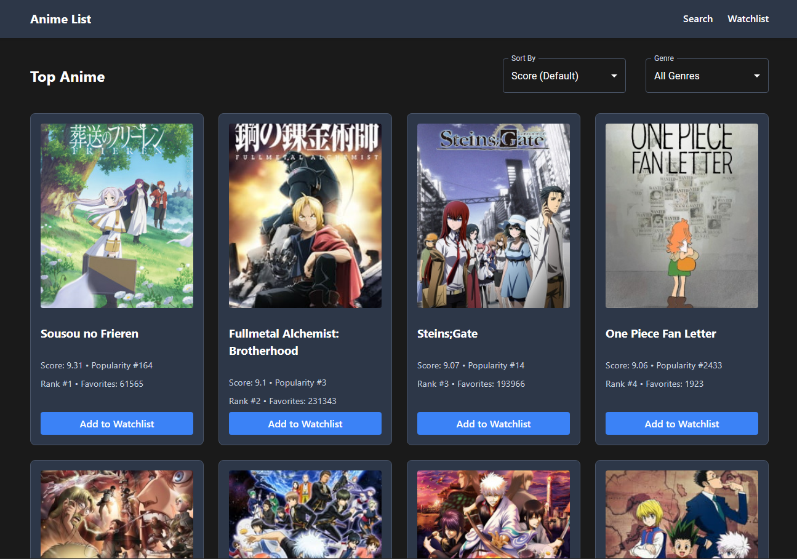

# Anime List

## Screenshot/Logo

## Live URL

[anime-list-987.netlify.app](https://anime-list-987.netlify.app/)

## Description

Anime List is my first React-based web application built with the objective of discovering, searching, and managing an anime watchlist. Users can browse top-rated anime, search for specific titles, view detailed information, and maintain a personal watchlist. Built with Vite and React, it integrates with the Jikan API for anime data and Airtable for persistent watchlist storage.

## MVP

The minimum requirements for the App is as follows (technical requirements for 1.1 below):

5 components
4 props
2 useState
2 React router routes
1 lifting state

## User Stories

As a user, I want to browse anime titles on the landing page.
As a user, I want to be able to filter anime by genre and sort by popularity.
As a user, i want to be able to search for my favourite anime.
As a user, I want to be able to view detailed information about an anime by clicking on the anime card.
As a user, I want to be able to add anime to a watchlist to view later.
As a user, I want to be able to remove anime from my watchlist.
As a user, I want to be able to clear all the anime in my watchlist.
As a user, I want to be able to toggle between light and dark mode.

[Screenshot](screenshot.png)

## Technologies Used

- **Frontend Framework**: React
- **Build Tool**: Vite
- **UI Components**: Material-UI
- **APIs**:
  - [Jikan API](https://docs.api.jikan.moe/) for anime data
  - [Airtable API](https://airtable.com/api) for watchlist storage
- **Routing**: React Router
- **Styling**: CSS Modules
- **Version Control**: Git/GitHub
- **Deployment**: Netlify/Vercel

## Features

- **Browse Top Anime**: View a curated list of top-rated anime with options to filter by genre as well as sort by popularity
- **Search Functionality**: Search for specific anime titles
- **Detailed Information**: View comprehensive details about each anime
- **Watchlist Management**: Add/remove anime to your personal watchlist
- **Theme Toggle**: Switch between light and dark modes
- **Responsive Design**: Works seamlessly on both desktop

## Technical Overview

### File Organization

src/
components/ # Reusable UI components
context/ # Theme context
hooks/ # Custom hooks (useWatchlist)
pages/ # Route components
services/ # API integration
styles/ # CSS files

### Key Components

1. **Layout Components**

   - Navbar: Navigation and branding
   - Footer: Theme toggle
   - Layout: Page structure

2. **Page Components**

   **HomePage**

   - Main landing page displaying top-rated anime
   - Features:
     - Allows users to filter by genre and sort by popularity
     - Fetches and displays a list of top anime from Jikan API
     - Shows anime in a grid layout using AnimeCard components
     - Implements pagination using Material UI's Pagination component
     - Allows users to add/remove anime from their watchlist

   **SearchResultsPage**

   - Handles search functionality and displays search results
   - Features:
     - Includes a search bar for new searches
     - Gets search query from URL parameters
     - Fetches matching anime from Jikan API based on search term
     - Implements pagination for search results, handling 20 results per page

   **AnimeDetailPage**

   - Displays detailed information about a specific anime
   - Features:
     - Uses URL parameters to get the anime ID
     - Fetches comprehensive anime data from Jikan API
     - Renders detailed information through AnimeDetail component

   **WatchlistPage**

   - Manages and displays the user's saved anime watchlist
   - Allows removal of individual anime from the watchlist
   - Includes a "Clear Watchlist" button to clear the entire watchlist

   **Common Patterns Across Components**

   - All components handle loading and error states
   - Share similar styling through imported CSS files
   - Use toast notifications for user feedback
   - Follow React best practices with hooks (useState, useEffect)
   - Interact with Jikan API for anime data
   - Integrate with watchlist system for user interaction

3. **Feature Components**
   - AnimeCard: Reusable card component for anime display
   - SearchBar: Search input and functionality
   - ThemeButton: Toggle between light/dark modes
   - Toast: Notification system

### State Management

- **Context API**: Manages theme state
- **Custom Hooks**:
  - `useWatchlist`: Manages watchlist operations
  - `useTheme`: Handles theme switching

### External APIs

- **Jikan API**: Fetches anime data
  - Top anime listings
  - Search results
  - Detailed anime information
- **Airtable API**: Stores watchlist data
  - Create records
  - Delete records
  - Fetch watchlist

### Styling

- CSS modules for component-specific styles
- Theme variables for consistent styling
- Responsive design using media queries
- Dark mode support

## Environment Setup

Create a `.env` file with the following variables:

- `VITE_AIRTABLE_API_KEY`: Your Airtable API key
- `VITE_AIRTABLE_BASE_ID`: Your Airtable base ID
- `VITE_AIRTABLE_TABLE_NAME`: Your Airtable table name

## Stretch goals

1. User authentication
2. Advanced filtering options
3. Anime recommendations
4. Social features (sharing, comments)
5. Personal rating system
6. Watch history tracking

## Attributions

- Anime data provided by [Jikan API](https://jikan.moe/)
- Icons from [Material-UI](https://mui.com/)
- Deployment platform: [Netlify](https://www.netlify.com/)
- React Router documentation and examples from [React Router](https://reactrouter.com/)
- Airtable documentation and examples from [Airtable](https://airtable.com/api)
